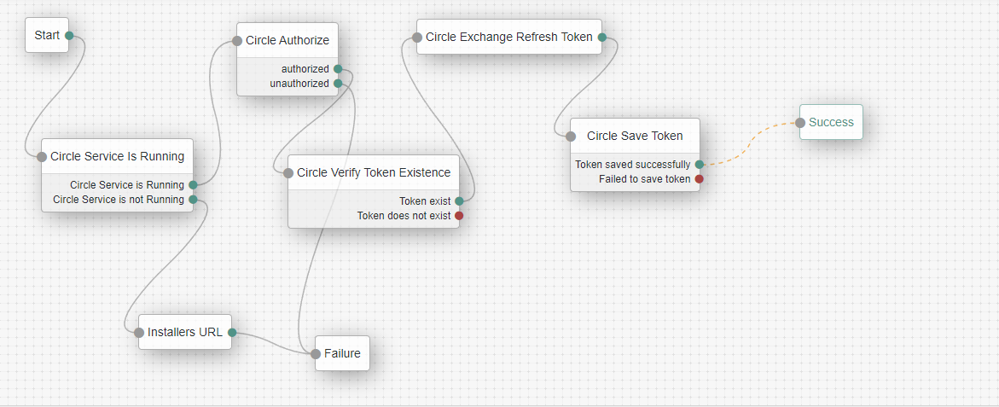

<!--
 *
 * Copyright 2021 Circle.
-->
# Circle Nodes for ForgeRock's

A Circle Service node collection for ForgeRock's [Identity Platform][forgerock_platform] 7.1.0 and above.  

## Installation

Copy the .jar file from the ../target directory into the ../web-container/webapps/app-name/WEB-INF/lib directory where AM is deployed.  Restart the web container to pick up the new nodes.  The nodes will then appear in the trees components palette.

        
## Circle Service is Running Node
This node check if Circle is running on the local machine.

### The node provides 2 outcomes:
- Circle Service is Running 
- Circle Service is not Running.

## Circle Authorize Node
This node Authorizes use of the CircleService.

### The node provides 2 outcomes
- authorized   
- unauthorized

### Node settings
- **App Key** The provided App Key provided by Circle
- **Secret Key** The Secret Key provided by Circle
- **Customer Code** The Customer code provided by Circle
- API URL (default Circle API URL.)

<h2>
 
## Circle Verify Token Existence Node
This node check if there is a refresh token saved on CircleService.

### Node settings
- **Token Name** The name of the token 
### The node provides 2 outcomes
- Token exist
- Token does not exist

 
## Circle Exchange Token Node
This node get a new access token and refresh token using the stored refresh token.
The new token is stored in the context transientState (refresh_token and access_token).

### Node settings
- **OAuth2 Client ID** The OAuth 2.0 Client ID
- **OAuth2 Client Secret** The OAuth 2.0 Client Secret
- **OAuth2 Access Token Endpoint** The OAuth 2.0 access token endpoint.

 
 
## Circle Save Token Node
This node stores the refresh token into CircleService.

### Node settings
- **Token Name** The name of the token 
### The node provides 2 outcomes
- Token saved successfully 
- Token failed to save token

## Circle OAuth2 Login Node
This node get an access token and refresh token using the User and Password provided.

### Node settings
- **OAuth2 Client ID** The OAuth 2.0 Client ID
- **OAuth2 Client Secret** The OAuth 2.0 Client Secret
- **OAuth2 Authenticvate Endpoint** The OAuth 2.0 client authentication token endpoint.
- **OAuth2 Authorize Endpoint** The OAuth 2.0 client authorize token endpoint.
- **OAuth2 Access Token Endpoint** The OAuth 2.0 client access token endpoint.
- **User application URL** The redirect URL

