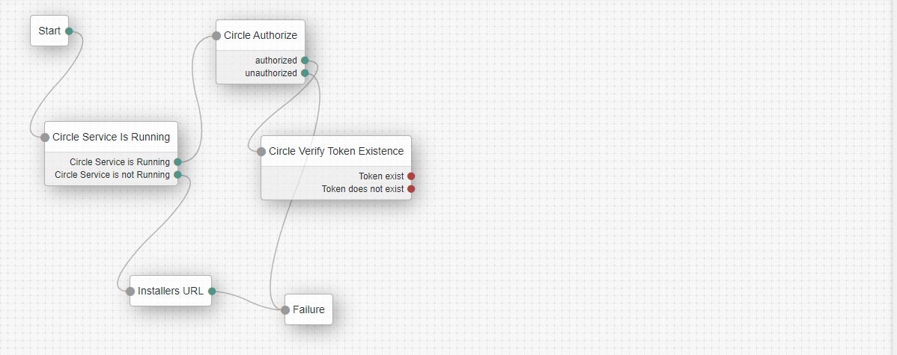
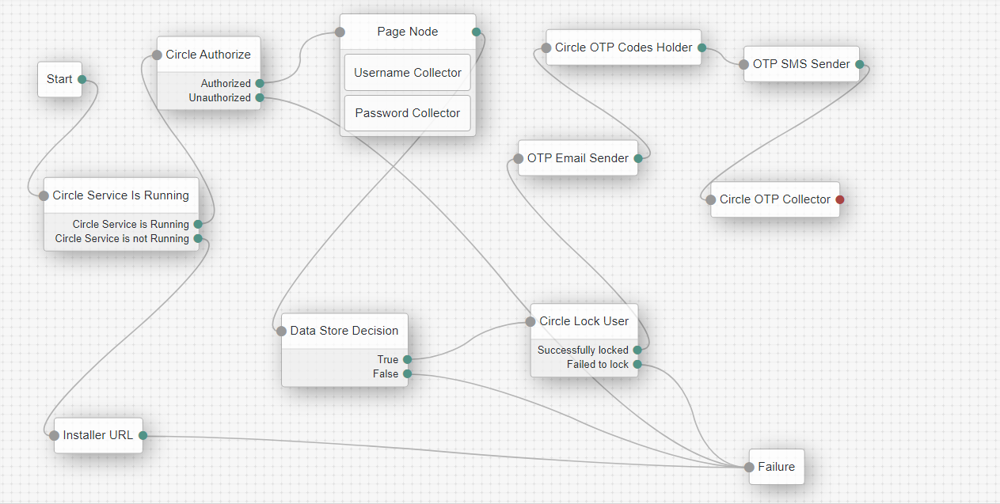

<!--
 *
 * Copyright 2021 Circle.
-->
# Circle Nodes for ForgeRock

A Circle Service node collection for ForgeRock [Identity Platform][forgerock_platform] 7.1.0 and above.  

## Installation

Copy the .jar file from the ../target directory into the ../web-container/webapps/app-name/WEB-INF/lib directory where AM is deployed.  Restart the web container to pick up the new nodes.  The nodes will then show up as tree components.

## To Build
run "mvn clean install" in the directory containing the pom.xml

## Circle Service is Running Node
This node check if Circle Service is running on the local machine.

### The node provides 2 outcomes:
- Circle Service is Running 
- Circle Service is not Running.

## Circle Authorize Node
This node Authorizes the usage of the Circle Service by getting a Token from Circle Servers. The Token is added to "Sharedstate" and passed to the other Circle Nodes

### The node provides 2 outcomes
- authorized   
- unauthorized

### Node settings
- **App Key** The App Key provided by Circle
- **Secret Key** The Secret Key provided by Circle
- **Customer Code** The Customer code provided by Circle
- API URL (the default Circle API URL.)

<h2>
 
## Circle Verify Token Existence Node
This node checks if there is a refresh token stored in Circle Service.

### Node settings
- **Token Name** A friendly name for the token (please make sure to use the same name to store the token) 
### The node provides 2 outcomes
- Token exists
- Token does not exist

 
## Circle Exchange Refresh Token Node
This node receives a new access token and a refresh token using the stored refresh token (Remember to send to Save Token Node to make sure you keep the updated refresh token)
The new tokens are stored into the "transientState" ({refresh_token} and {access_token}).

### Node settings
- **OAuth2 Client ID** The OAuth 2.0 Client ID
- **OAuth2 Client Secret** The OAuth 2.0 Client Secret
- **OAuth2 Access Token Endpoint** The OAuth 2.0 access token endpoint.

 
 
## Circle Save Token Node
This node stores the refresh token in the Circle Service.

### Node settings
- **Token Name** A friendly name for the token (please make sure to use the same name to restore the token) 
### The node provides 2 outcomes
- Token saved successfully 
- Failed to save token

## Circle OAuth2 Login Node
This node does the whole OAuth2 flow starting with a username and password and ends up with an access token and a refresh token.

### Node settings
- **OAuth2 Client ID** The OAuth 2.0 Client ID
- **OAuth2 Client Secret** The OAuth 2.0 Client Secret
- **OAuth2 Authenticate Endpoint** The OAuth 2.0 client authentication token endpoint.
- **OAuth2 Authorize Endpoint** The OAuth 2.0 client authorize token endpoint.
- **OAuth2 Access Token Endpoint** The OAuth 2.0 client access token endpoint.
- **User application URL** The redirect URL
 
 

# Reauthentication Flow

## Circle Lock User
This node locks the user and stores the unlock codes into transientState.

### Node settings
- **Circle Private Key** Private key received upon registration

### The node provides 2 outcomes
- Successfully locked
- Failed to lock

## Circle OTP Codes Holder
This node holds the second unlock code in the transienteState {oneTimePassword} 

## Circle OTP Collector
This node collects the unlock codes and stores in sharedState.

## Circle Unlock User
This node presents a screen with 2 inputs for entering the unlock codes. It then reads the unlock codes from sharedState ({code 1} and {code 2}) and, if the codes are correct, unlocks the user.

### The node provides 2 outcomes
- Successfully unlocked
- Failed to unlock

